# LAPORAN PRAKTIKUM

## Membuat Repository

### Step 1 : Pembuatan Akun Github
Buatlah akun pada github.com jika belum memilikinya,
Jika sudah punya/selesai membuat maka tampilannya akan seperti ini pada menu PROFIL :
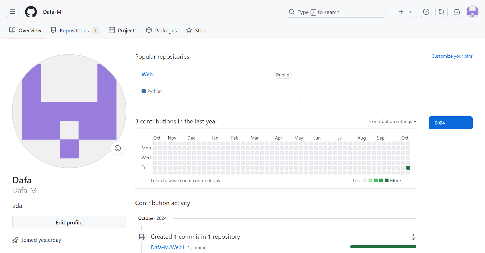

### Step 2 : Buat file Repository
Setelah itu kembali ke HOME dan tekan NEW :
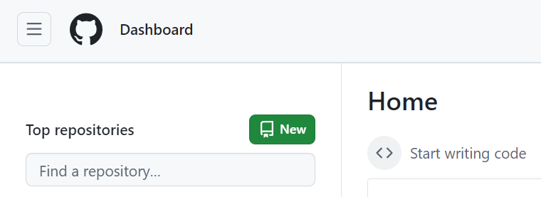
setelah ditekan maka tampilannya akan seperti di bawah, setting Public pada 2 pilihan pada gambar :
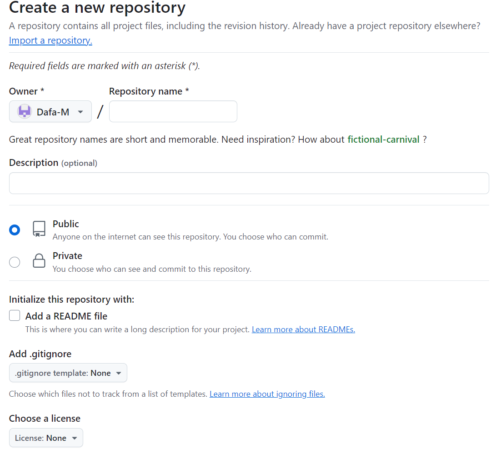
Tekan Create Repository :
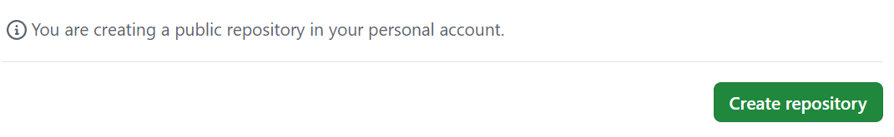

### Step 3 : Penginstalan Git Tools
Download terlebih dahulu Git Tools dengan mengetik git=scm dipencarian google, lalu tekan Download for Windows :
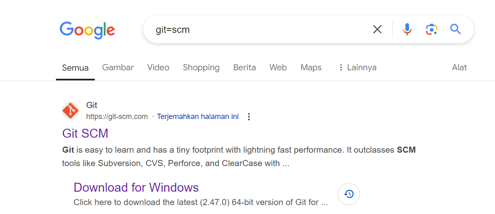
Setelah itu tekan "Click here to download" :
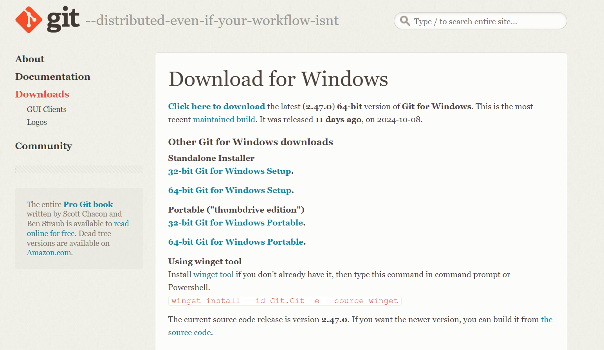
Setelah didownload, kita masuk ke proses Penginstalan tekan apk git tools yang sudah didownload lalu klik next terus hingga tampilannya seperti ini,
lalu tekan instal :
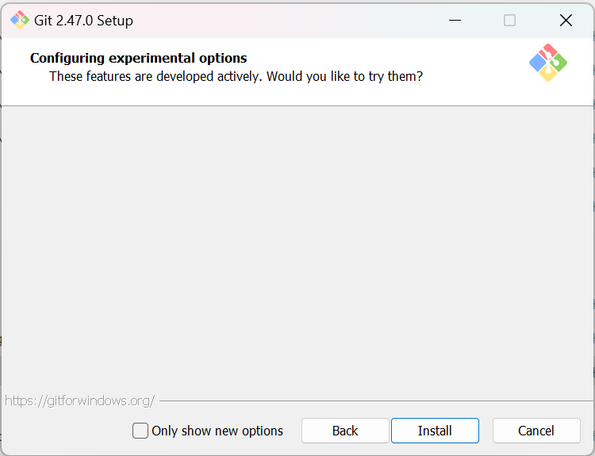
Tunggu hingga proses Penginstalan selesai hingga tampilannya seperti di bawah lalu tekan finish :

### Step 4 : Pengoperasian Git Tools
Setelah clear Penginstalan maka tampilannya akan seperti digambar :
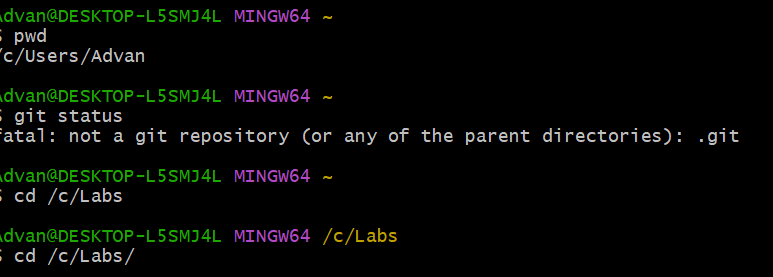
Kode awal yang di buat berupa 'pwd' untuk memeriksa data file
Sebelum masuk langkah selanjutnya copy code github kamu dikolom CODE :
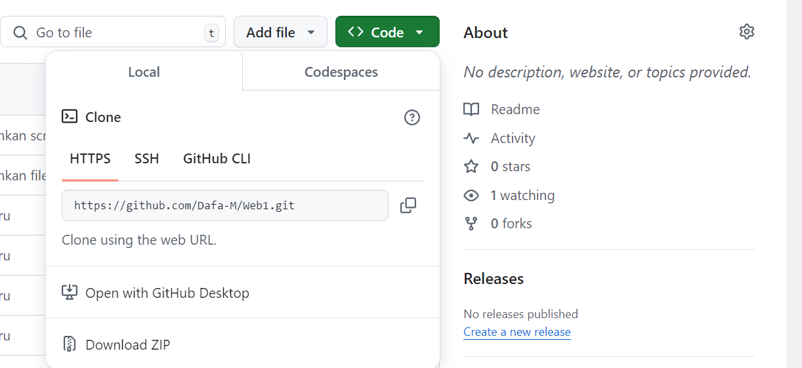
Lalu kembali ke Git Tools dan lanjutkan dengan 'git clone pastelinkgithub'
setelahnya cari file README.md pada file web1 :
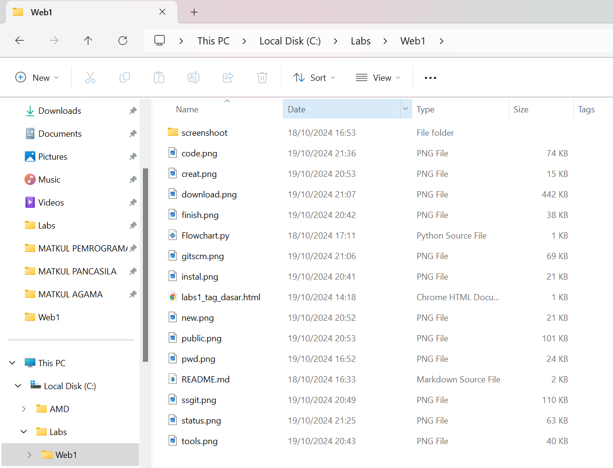
Lalu buka file README.md dengan VS Code maka tampilannya seperti ini :
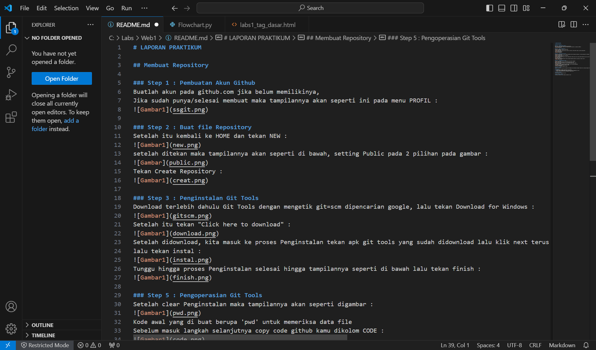
Lalu buat file baru :
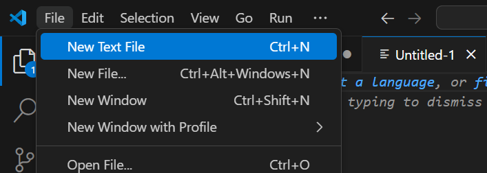
Ganti menjadi python :
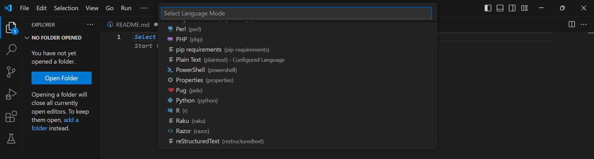
Dan save pada file web1, ganti nama sesuai kemauan :
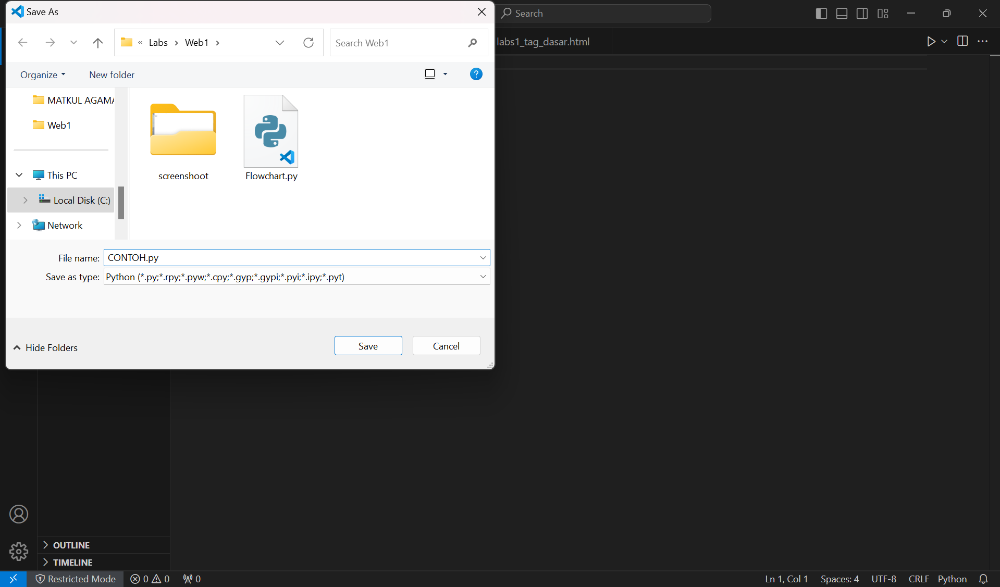

## Deskripsi Program
Program ini menerima tiga input bilangan dari pengguna dan menentukan bilangan terbesar dari ketiga bilangan tersebut. Program ini menggunakan kondisi if-elif untuk membandingkan bilangan-bilangan yang dimasukkan oleh pengguna.

### Algoritma:
1.  Program meminta pengguna memasukkan tiga bilangan.
2. Program kemudian membandingkan ketiga bilangan tersebut menggunakan if-elif.
3. Bilangan yang paling besar akan ditampilkan sebagai hasil.

## Flowchart Program
(sertakan gambar flowchart di sini)

## Hasil Eksekusi Program
(sertakan screenshot hasil eksekusi program di sini)