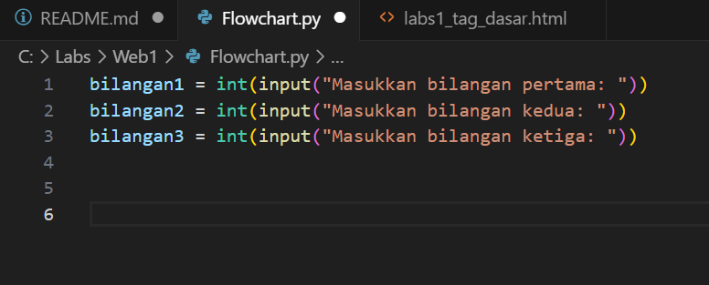
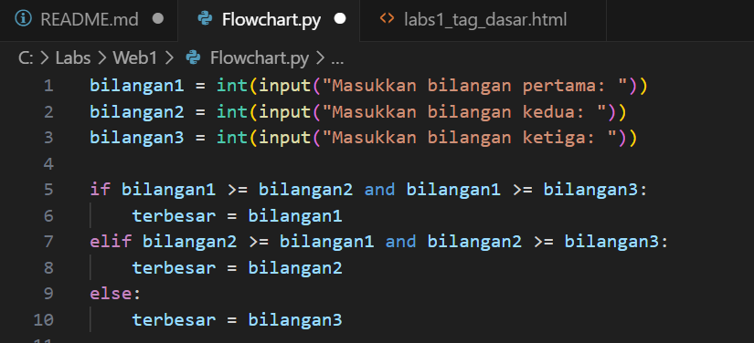
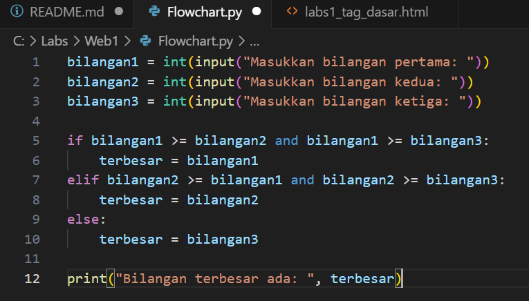
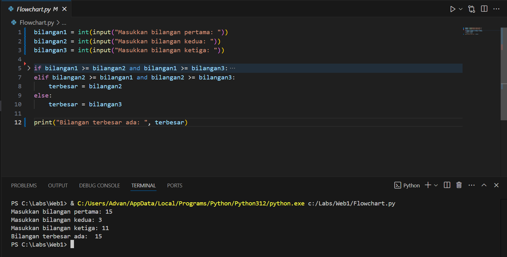

# LAPORAN PRAKTIKUM

## MEMBUAT REPOSITORY

### Step 1 : Pembuatan Akun Github
Buatlah akun pada github.com jika belum memilikinya,
Jika sudah punya/selesai membuat maka tampilannya akan seperti ini pada menu PROFIL :

### Step 2 : Buat file Repository
Setelah itu kembali ke HOME dan tekan NEW :

setelah ditekan maka tampilannya akan seperti di bawah, setting Public pada 2 pilihan pada gambar :

Tekan Create Repository :

### Step 3 : Penginstalan Git Tools
Download terlebih dahulu Git Tools dengan mengetik git=scm dipencarian google, lalu tekan Download for Windows :

Setelah itu tekan "Click here to download" :

Setelah didownload, kita masuk ke proses Penginstalan tekan apk git tools yang sudah didownload lalu klik next terus hingga tampilannya seperti ini,
lalu tekan instal :

Tunggu hingga proses Penginstalan selesai hingga tampilannya seperti di bawah lalu tekan finish :

### Step 4 : Pengoperasian Git Tools
Setelah clear Penginstalan maka tampilannya akan seperti digambar :

Kode awal yang di buat berupa 'pwd' untuk memeriksa data file
Sebelum masuk langkah selanjutnya copy code github kamu dikolom CODE :

Lalu kembali ke Git Tools dan lanjutkan dengan 'git clone pastelinkgithub'
setelahnya cari file README.md pada file web1 :

Lalu buka file README.md dengan VS Code maka tampilannya seperti ini :

Lalu buat file baru :

Ganti menjadi python :

Dan save pada file web1, ganti nama sesuai kemauan :

Kembali ke Git Tools, ketik 'git add web1/' untuk menambahkan, lalu commit dengan mengetik 'git commit -m (komentar bebas)', jika sudah ketik lagi 'git push -u origin main' maka konten yang kita tambahkan pada file web1 sudah terupdate digithub

## MEMBUAT CODE PROGRAM FLOWCHART DENGAN PYTHON

### Step 1 :
Pada langkah pembuatan repository kita sudah membuat file baru berupa python, sekarang kita akan coba membuat code program flowchart menggunakan python. Buat code program inputkan bilangan dengan menggunakan integer untuk memasukan bilangan bulat :

Dilanjutkan dengan memasukan if, elif dan else untuk membandingkan dari 3 bilangan yang sudah di inputkan. Penjelasannya :

Jika Bilangan1 lebih besar atau sama dengan >= Bilangan2  dan Bilangan1 lebih besar atau sama dengan >= Bilangan3 maka yang terbesar Bilangan1

Kemungkinan lain Bilangan2 lebih besar atau sama dengan >= Bilangan1  dan Bilangan2 lebih besar atau sama dengan >= Bilangan3 maka yang terbesar Bilangan2

Selain dari itu maka yang terbesar Bilangan3

Setelah code proses sudah selesai maka masukan output untuk di tampilkan, printah 'print' digunakan untuk output :

Selanjutnya kita coba run code program dan inputkan bilangan :
Bilangan1 = 15
Bilangan2 = 3
Bilangan3 = 11
maka akan ditampilan output terbesar dari 3 bilangan yang sudah di input : Bilangan1 = 15

## Deskripsi Program
Program ini menerima tiga input bilangan dari pengguna dan menentukan bilangan terbesar dari ketiga bilangan tersebut. Program ini menggunakan kondisi if-elif untuk membandingkan bilangan-bilangan yang dimasukkan oleh pengguna.

### Algoritma:
1.  Program meminta pengguna memasukkan tiga bilangan.
2. Program kemudian membandingkan ketiga bilangan tersebut menggunakan if-elif.
3. Bilangan yang paling besar akan ditampilkan sebagai hasil.

## Flowchart Program
(sertakan gambar flowchart di sini)

## Hasil Eksekusi Program
(sertakan screenshot hasil eksekusi program di sini)